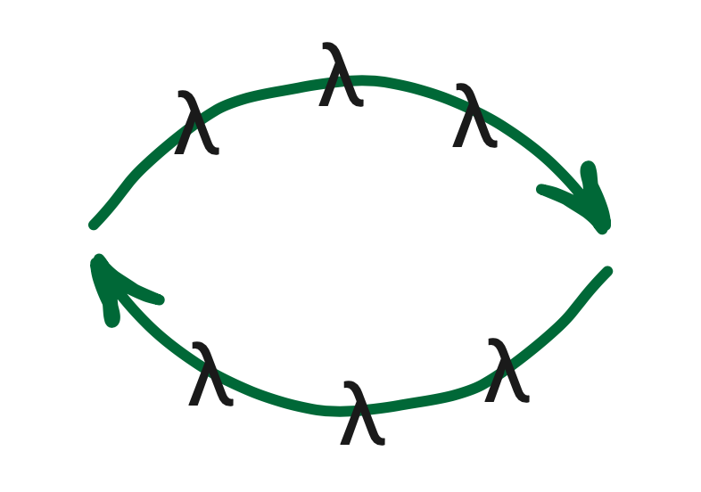

# context-fp



Microscopic functional programming context for TypeScript <br/>

## Motivation

if you tired from gygantic TypeScript DI containers, based on classes and decorators, you are in the right place <br/>
Just use functional programming and don't worry about context passing through functions, it's with you

## Features

* 🤏 Microscopic, few kilobytes size and most of it is TypeScript generics
* 💉 Dependency injection without classes and decorators, only functions
* 🤌 Functions cached during workflow, no excess cost of CPU
* 💡 Smart type inference, only describe type of context and rest will be inferred
* ♻️ Unit tests friendly, feel free to call any function directly in the workflow
* 📦 Tiny Redux like state manager also attached

## How to

#### Basic example

```typescript
import { cfp } from 'context-fp'
import assert from 'node:assert'

type Context = { numbers: number[] }

const positiveNumbers = ({ numbers }: Context) => numbers.filter(n => n > 0)

const numbersPrefix = () => 'Here is numbers:'

const positiveNumbersAsString = cfp(
  numbersPrefix,
  positiveNumbers,
  (prefix, numbers) => `${prefix} ${numbers.toString()}`
)

assert.strictEqual(
  positiveNumbersAsString({ numbers: [-1, -5, 7, 0, 4] }),
  'Here is numbers: 7,4'
)
```

#### Calculations cached example

```typescript
import { cfp } from 'context-fp'
import assert from 'node:assert'

let called = 0

const positiveNumbers = ({ numbers }: { numbers: number[] }) =>
  (called++, numbers.filter(n => n > 0))

const positiveNumbersLength = cfp(positiveNumbers, ns => ns.length)

const positiveNumbersAsString = cfp(
  positiveNumbers,
  positiveNumbersLength,
  (ns, l) => `${ns.toString()}; length - ${l}`
)

assert.strictEqual(
  positiveNumbersAsString({ numbers: [-1, -5, 7, 0, 4] }),
  '7,4; length - 2'
)
assert.strictEqual(called, 1)
```

#### Unit tests example

```typescript
import { cfp } from 'context-fp'
import assert from 'node:assert'

type Context = { numbers: number[] }

const positiveNumbers = ({ numbers }: Context) => numbers.filter(n => n > 0)

const numbersPrefix = () => 'Here is numbers:'

const positiveNumbersAsString = cfp(
  numbersPrefix,
  positiveNumbers,
  (prefix, numbers) => `${prefix} ${numbers.toString()}`
)

assert.strictEqual(
  positiveNumbersAsString.raw('Here is numbers:', [7, 4]),
  'Here is numbers: 7,4'
)
```

#### Dependency injection example

```typescript
import { cfp } from 'context-fp'
import assert from 'node:assert'

const fetchUserFromDB = async (): Promise<{ name: string }> => {
  // some production implementation
}

const fetchUser = ({ fetchUser }: { fetchUser?: typeof fetchUserFromDB }) =>
  fetchUser?.() ?? fetchUserFromDB()

const helloWorldUser = cfp(
  fetchUser,
  user => user.then(({ name }) => `Hello world, ${name}!`)
)

assert.strictEqual(
  await helloWorldUser({ fetchUser: async () => ({ name: 'Vasya' }) }),
  'Hello world, Vasya!'
)
```

#### State manager example

```typescript
import { cfp, sfp } from 'context-fp'
import assert from 'node:assert'

const numbers = ({ incNumber }: { incNumber: number }) =>
  sfp((ns: number[], n: number) => [...ns, n + incNumber], [])

const addNumber1 = cfp(numbers, ns => ns(1))
const addNumber2 = cfp(numbers, ns => ns(2))
const addNumber3 = cfp(numbers, ns => ns(3))

const numbersToString = cfp(
  numbers,
  addNumber1,
  addNumber2,
  addNumber3,
  ns => ns().toString()
)

assert.strictEqual(numbersToString({ incNumber: 1 }), '2,3,4')
```
